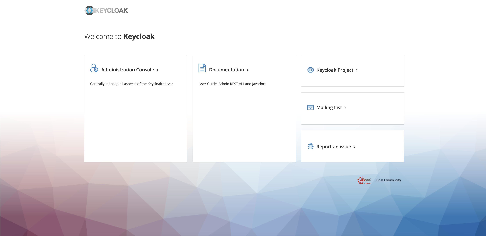
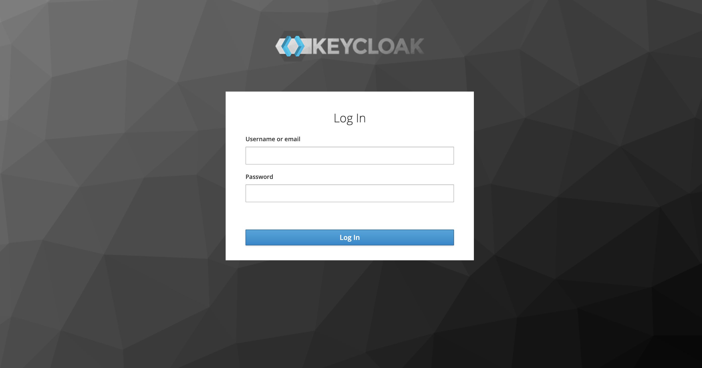
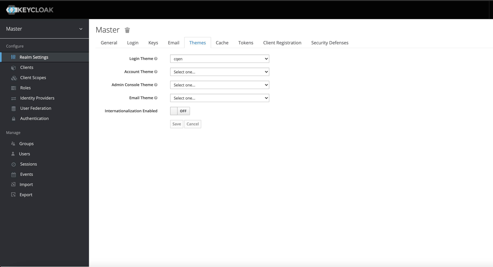

# keycloak-custom


## Quickstart
---
### Build image
```bash
$ sudo docker build . -t keycloak-cqen
```

### Start keycloak
*Nice to read multiline*
```bash
$ sudo docker run -d --name keycloak-cqen \
                  -p 8080:8080 \
                  -e "KEYCLOAK_USER=admin" \
                  -e "KEYCLOAK_PASSWORD=cqen" \
                  -e "KEYCLOAK_WELCOME_THEME=cqen" \
```

*Copy & Paste friendly one-liner*
```bash
$ sudo docker run -d --name keycloak-cqen -p 8080:8080 -e "KEYCLOAK_USER=admin" -e "KEYCLOAK_PASSWORD=cqen" -e "KEYCLOAK_WELCOME_THEME=cqen"
```

### Access Keycloak
Browse to http://localhost:8080 and go to Administration Console.


Login with user: admin and password: cqen.


Set cqen theme


## Customize cqen theme
---
Themes are built with [Apache FreeMarker](https://freemarker.apache.org/). This keycloak docker installation is configured to instantly reflect changes in theme files for development purposes. More on this in the [Official Documentation](https://www.keycloak.org/docs/4.4/server_development/index.html#_themes).

To live edit cqen, with this repository files please run:

*Nice to read multiline*
```bash
$ sudo docker run -d --name keycloak-cqen \
                  -p 8080:8080 \
                  -e "KEYCLOAK_USER=admin" \
                  -e "KEYCLOAK_PASSWORD=cqen" \
                  -e "KEYCLOAK_WELCOME_THEME=cqen" \
                  -v $(pwd)/cqen:/opt/jboss/keycloak/cqen:rw
                  cqen/keycloak:4.4.0.Final
```

*Copy & Paste friendly one-liner*
```bash
$ sudo docker run -d --name keycloak-cqen -p 8080:8080 -e "KEYCLOAK_USER=admin" -e "KEYCLOAK_PASSWORD=cqen" -e "KEYCLOAK_WELCOME_THEME=cqen" -v $(pwd)/cqen:/opt/jboss/keycloak/cqen:rw
```

### Docker Image files
cqen theme files are inside `cqen/` directory while custom configurations reside in `customization` directory. All content is copied during docker build.

## Docker Environment Variables
---
As seen in _Start Keycloak_ section, some variables are needed to bootstrap Keycloak. As this is an extension of the official Docker image we recommend reading through the [Official Docker Image Documentation](https://hub.docker.com/r/jboss/keycloak/). Variables shown here are:

* `KEYCLOAK_USER`: set keycloak admin user. There's no default value, if it is not set then direct access to container shell is needed to use [kcadm](https://www.keycloak.org/docs/4.4/server_admin/#the-admin-cli).
* `KEYCLOAK_PASSWORD`: set keycloak admin user password. There's no default value, if it is not set then direct access to container shell is needed to use [kcadm](https://www.keycloak.org/docs/4.4/server_admin/#the-admin-cli).
* `KEYCLOAK_WELCOME_THEME`: specify the theme to use for welcome page (must be non empty and must match an existing theme name).

## Reference

https://github.com/DemocracyOS/keycloak